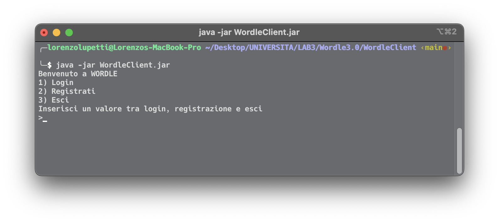
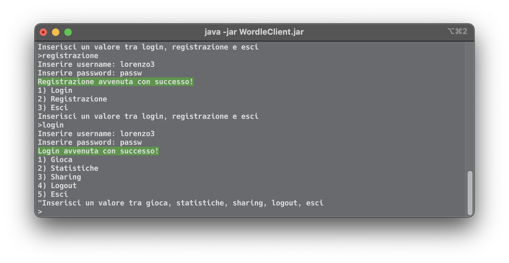
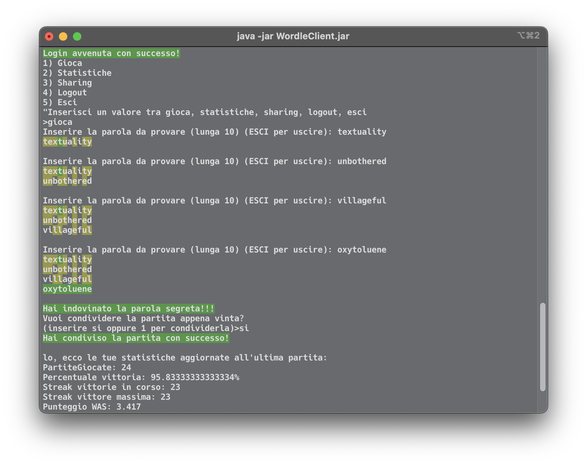

# Wordle3.0

Progetto in java per laboratorio 3

# Istruzioni di compilazione e avvio

## **Server**

**Andare nella cartella ./WordleServer.**

- Le configurazioni possono essere modificate nel file ./server.properties, e sono:
    1. serverport: porta su cui attivare l’applicazione
    2. servermulticast: indirizzo ip del gruppo multicast
    3. portamulticast: porta del gruppo multicast
    4. wordduration: tempo tra una parola segreta e la prossima

**Compilazione:**

```bash
    `javac -cp ".:./gson-2.8.2.jar" *.java`
```

**Esecuzione:**

```bash
    `java -cp ".:./gson-2.8.2.jar" WordleServerMain`
```

**Esecuzione jar:**

```bash
    `javac -cp "java -jar WordleServer.jar`
```

Se è stato attivato con successo stamperà sul terminale: [SERVER] WordleServer started on port ___ e la parola segreta iniziale.

## **Client**

**Andare nella cartella ./WordleClient.**

- Le configurazioni possono essere modificate nel file ./client.properties, e sono:
    1. server: hostname o ip del server
    2. portaserver: porta del server
    3. servermulticast: indirizzo ip del gruppo multicast
    4. portamulticast: porta del gruppo multicast

**Compilazione:**

```bash
    `javac *.java`
```

**Esecuzione:**

```bash
    `java WordleClientMain`
```

**Esecuzione jar:**

```bash
    `javac -cp "java -jar WordleClient.jar`
```

Da avviare dopo l’ attivazione del server, se eseguito con successo e connesso al server stamperà sul terminale: Benvenuto a Wordle e il menu iniziale.

# Esempio di funzionamento del client

**Appena accesa l’applicazione viene mostrato il primo menu:**



**A questo punto, digitare login, registrazione oppure esci.
Dopo essersi registrati e/o loggati, viene mostrato il secondo menù dove puoi giocare, vedere le statistiche, vedere notifiche, effettuare logout o uscire:**



**Esempio di vittoria e successiva condivisione della partita:**

